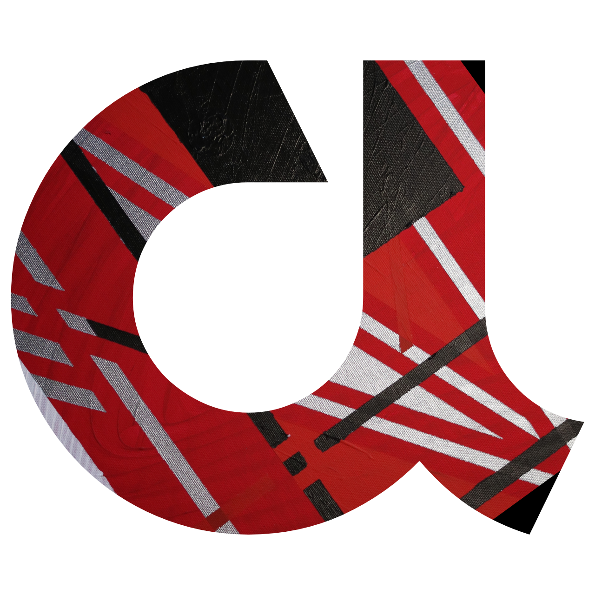

# A-Concept 

🚀 A Paradigm Shift for Software Development in the Age of AI and  [Industry 5.0](https://research-and-innovation.ec.europa.eu/research-area/industrial-research-and-innovation/industry-50_en). 


---

## 📖 **Table of Contents**

1. [Overview](#-overview)
2. [Why Choose A-Concept?](#-why-choose-a-concept)
3. [Core Principles](#-core-principles)
    - [Technology](#-technology)
    - [Collaboration](#-collaboration)
    - [Bridging Architecture & Code](#-bridging-architecture--code)
4. [Getting Started](#-getting-started)
5. [Challenges in Modern Development](#-challenges-in-modern-development)
    - [AI Hallucinations and Incorrect Code Outputs](#-ai-hallucinations-and-incorrect-code-outputs)
    - [The Gap Between Software Design and Implementation](#-the-gap-between-software-design-and-implementation)
    - [Scaling and Product Evolution](#-scaling-and-product-evolution)
    - [Inappropriate Role Combinations and Team Structures](#-inappropriate-role-combinations-and-team-structures)
    - [Outdated SDLC Methodologies](#-outdated-sdlc-methodologies)
6. [About the Team](#-about-the-team)

---


## 📖 Overview

A-Concept is a modern framework created by the ADAAS R&D team to redefine how we design and develop software in the Industry 5.0 era. It combines:

1. **The A-Concept Paradigm**: A revolutionary architectural framework rooted in an enhanced C4 model, designed to bridge software design and actual development.

2. **The A-Concept Framework**: A robust software development toolkit that brings the paradigm to life. It includes tools, APIs, and integrations to enable developers to implement the A-Concept methodology seamlessly in their projects, regardless of the platform or domain.

3. **A-Concept Ecosystem**: A suite of AI-prepared components, libraries, and modules designed to ensure AI-generated code is not only functional but also architecturally sound.

With A-Concept, developers and businesses can create software that evolves seamlessly, breaking free from outdated methodologies and limitations.

## 🌍 Core Principles

### 🔧 Technology

Unlike traditional frameworks that impose restrictions, A-Concept:
- Offers tools, not rules.
- Encourages flexibility to build, combine, and innovate across platforms.
- Provides AI-ready modules for faster and more accurate development.

### 🫠 Collaboration

SCRUM is outdated. Here’s why A-Concept takes a futuristic approach:
- Simplifies processes for solo entrepreneurs and lean enterprises.
- Eliminates unnecessary rituals, focusing instead on results and innovation.
- Enhances developer productivity by automating repetitive tasks, enabling teams to focus on optimized, high-quality code.

### 🔽 Bridging Architecture & Code

Traditional development often struggles with a disconnect between architecture and code. A-Concept fixes this by:
- Extending the C4 model to include design capabilities.
- Ensuring architecture and code stay in sync with AI-assisted tools.
- Empowering developers to become architects with intuitive and self-documented workflows.


## Problems 


## 📂 Getting Started

```bash
cd /your/project/location
npm i @adaas/a-concept
```
Then export 

```ts 
import { Concept } from '@adaas/a-concept';
const concept = new Concept({
    name: 'my-concept'
});
```

and extend 

```ts
(async () => {
    const concept = new A_Concept({
        name: 'test-simple',
        fragments: [
            new A_Config({
                variables: ['CONFIG_VERBOSE'],
                defaults: {
                    'CONFIG_VERBOSE': true
                }
            })
        ],
        containers: [
            new A_ConfigLoader({
                components: [
                    ENVConfigReader
                ]
            })
        ]
    });

    await concept.start();
})();
```


## 👨‍💻 About the Team

The [ADAAS R&D](https://adaas.org) team comprises seasoned developers and architects who’ve been part of software evolution from its early days. We understand the pain points of traditional methodologies and are passionate about creating tools that bridge gaps and propel development into the future.


## 🗋 Challenges in Modern Development

### 🚀 AI Hallucinations and Incorrect Code Outputs

The rapid rise of AI tools for code generation has introduced a significant challenge: hallucinations. These occur when AI generates plausible-looking but fundamentally flawed code. While impressive, AI outputs often lack precision and fail to align with the overall architectural vision.

Solution:
A-Concept creates an ecosystem where AI operates within clearly defined boundaries, leveraging self-documenting primitives and an extended C4 model. This ensures that AI’s contributions align with the intended design and functionality.

### 🔗 The Gap Between Software Design and Implementation

One of the most persistent problems in software development is the disconnect between high-level architectural plans and actual implementation. Traditional methodologies often result in documentation that quickly becomes outdated, leading to chaotic, hard-to-maintain codebases.

Solution:
A-Concept merges design and implementation into a single, seamless process. The framework’s self-documenting capabilities mean that architecture is always synchronized with the code, offering clarity for both developers and stakeholders.

### 📈 Scaling and Product Evolution

Scaling a product over time is a daunting task. As projects grow, technical debt accumulates, making it harder to introduce new features or pivot to meet market demands. Existing frameworks often fail to provide tools that support long-term evolution.

Solution:
A-Concept introduces an ecosystem built with scalability in mind. Its modular design enables projects to adapt, evolve, and scale without compromising the integrity of the underlying architecture.

### 🛠️ Inappropriate Role Combinations and Team Structures

The industry’s current approach to team roles and responsibilities is often inefficient. Developers juggle multiple hats, ranging from low-level coding to high-level architectural design. This mismatch leads to burnout and suboptimal results.

Solution:
A-Concept reimagines collaboration by enabling developers to focus on their strengths. The framework’s tools allow low-level specialists to optimize performance while product-focused professionals drive business outcomes. AI handles routine tasks, freeing teams to innovate.

### 🗂 Outdated SDLC Methodologies

Traditional methodologies like SCRUM and Waterfall were revolutionary in their time, but they struggle to meet the demands of modern software development. These methodologies are ritual-heavy, time-consuming, and ill-suited for AI-driven development.

Solution:
A-Concept promotes a streamlined approach. By leveraging AI and rethinking team structures, we eliminate unnecessary rituals and focus on achieving results. This makes the development process leaner, faster, and more aligned with business goals.


## License

This project is licensed under the [Apache License 2.0](LICENSE).

© 2025 ADAAS YAZILIM LİMİTED ŞİRKETİ All rights reserved.  
All original code and concepts are the intellectual property of ADAAS YAZILIM LİMİTED ŞİRKETİ
